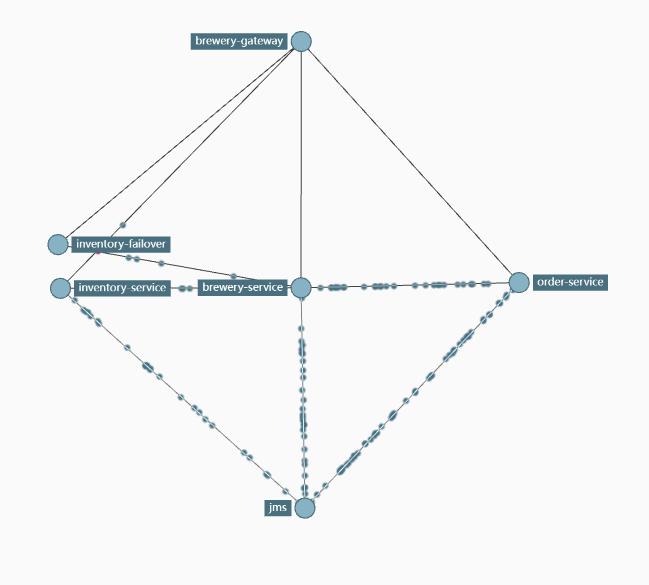
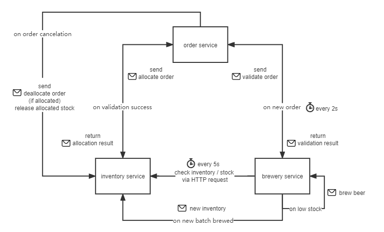

# Microservice-Backend-Beer-Store
This repo integrated various Spring Boot microservices &amp; Spring Cloud components repos, which constitute a backend service for a beer store.

Docker images of every microservices & components were built. 

- See [`How to deploy`](#how-to-deploy) to deploy the application **within 3 minutes** using docker. 
- See [`Project Architecture`](#project-architecture) for a summarization of microservices & Spring Cloud components.
- See [`Ports & APIs`](#ports--apis) for testing the functionality of the application.
- See [`Business Logic`](#business-logic) for how microservices interact with each other.

## How to deploy

- **Before you run it**: Make sure you have installed docker and docker-compose. Allocate enough RAM for your docker containers (8GB may be enough), as 12 containers will be running simultaneously once started.

- In your terminal: 
  
  - `git clone [--recursive] https://github.com/HaolinZhong/Microservice-Backend-Beer-Store.git`:  `--recursive` is optional. Ignore it if you don't want source code of submodules in this repo.
  
  - `cd local\ deployment/`: change directory to the `local deployment` folder.

  - `docker compose up`: let docker download images and run them as containers according to `compose.yml`.

  - Wait for 1 or 2 minutes for all the service to be up and functioning.
  
- Terminate the application: `docker compose down`

## Project Architecture

## Ports & APIs

- `http://localhost:8761/`: Eureka Dashboard showing registered instances.

  - username: eurekaUser, password: eurekaPassword

    

- `http://localhost: 9411/zipkin`: Zipkin Dashboard for visulization of traces.

  - try any of the gateway api below to let `Gateway` appear on the tracing map.

  - try to manually shut down `Inventory Service` to let `Inventory Failover` appear on the tracing map.

  - a full view of traces:

    

  

- `http://localhost:9090/`: Spring Cloud Gateway

  - requests redirect to brewery service controller:
    - `api/v1/beer`: 
      - `GET`: return all beers basic information, paged. add `?showInventory=true` to show beer stock.
      - `POST`: save the beer object post if it is valid.

    - `api/v1/beer/{beerId}`:
      - `GET` :  return infomation of the given beer designated by id. BeerId example: `095c83ee-c1bf-4933-8389-21bb6cedcd3f`. add `?showInventory=true` to show beer stock.
      - `PUT`: update the given beer if beer object post is valid.

    - `api/v1/beerUpc/{upc}`:
      - `GET`: return infomation of the given beer designated by UPC.

  - requests redirect to inventory service controller:
    - authentication required. username: `MyInventory`, `MyInventoryPw`
    - `api/v1/beer/{beerId}/inventory`
      - `GET` : return all inventory of the designated beer.

  - requests redirect to order service controller:
    - `/api/v1/customers`
      - `GET`: get all customers basic information (no sensitive info). paged.

    - `/api/v1/customers/{customerId}/orders`
      - `GET`: get all orders created by the designated customer
      - `POST`: create a new order for the designated customer

    - `/api/v1/customers/{customerId}/orders/{orderId}`
      - `GET`: get the designated order information for the customer

    - `/api/v1/customers/{customerId}/orders/{orderId}/pickup`
      - `PUT`: change the designated order status to `PICKED_UP`, if the current order status is `ALLOCATED`.

- List of ports of all containers:

  | Service Name       | Port                                                         |
  | ------------------ | ------------------------------------------------------------ |
  | Brewery Service    | 8080                                                         |
  | Order Service      | 8081                                                         |
  | Inventory Service  | 8082 (username: MyInventory; password: MyInventoryPw)        |
  | Inventory Failover | 8083                                                         |
  | JMS (Active MQ)    | 8161 (management console; username: artemis; password: simetraehcapa) 61616 (broker url) |
  | Eureka             | 8761 (username: eurekaUser; password: eurekaPassword)        |
  | Config Server      | 8888 (username: MyUsername; password: MySecretPassword)      |
  | Gateway            | 9090                                                         |
  | Zipkin             | 9411                                                         |
  | MySQL-beer         | 3306 (username: brewery_service; password: mysqlpw)          |
  | MySQL-inventory    | 3307 (username: brewery_inventory_service; password: mysqlpw) |
  | MySQL-order        | 3308 (username: brewery_order_service; password: mysqlpw)    |

  

## Business Logic

The main bussiness logic is described as follows. All messages are actually sent to and received from message queues, but for conciseness we directly say, send to / receive from XXX service. The order status is managed by Spring State Machine.

- brewery service:
  - For every 5 seconds, check inventory for every kind of beer through sending HTTP requests to inventory services. If the inventory is lower than the pre-set minimum, send a `brew beer message`.
  - Upon receiving:
    - `brew beer message` (from itself): brew the beer at a pre-set amount, then send a `new inventory message` to inventory service.
    - `validate order message` (from order service): check the beer info in the order is consistent with local storage, then send back the `validation result message`.

- inventory service
  - Upon receiving:
    - `new inventory message` (from brewery service): store new inventory into database
    - `allocate order message` (from order service): check whether stocks of beers meet the requirement of the order, then send back the `allocation result message`
    - `deallocate order message` (from order service): re-store the stock of the cancelled order into database.

- order service

  - For showing the bussiness logic, a user was set in this service who randomly place orders of differents beers & at different amount every 2 seconds.
  - When an order is placed, the corresponding order object will be created and stored into database. Then, a `validate order message` will be sent to brewery service.
  - Upon receiving
    - `validation result` (from brewery service):  if order is valid, update order status to validated, send `allocate order message` to inventory service.
    - `allocation result` (from inventory service): if stock is enough, update order status to allocated, wait for user to pick up. Otherwise, update order status to pending inventory.
    - `cancel order`: User may cancel the order at any time point. If the cancelled order is already allocated, send `deallocate order message` to inventory service as a compensating transaction. Otherwise, only update the order status to cancelled (no action needed since no stock allocated).
    - `validation / allocation error`: if error occured in validation / allocation, update the order status to validation / allocation exception.

  

