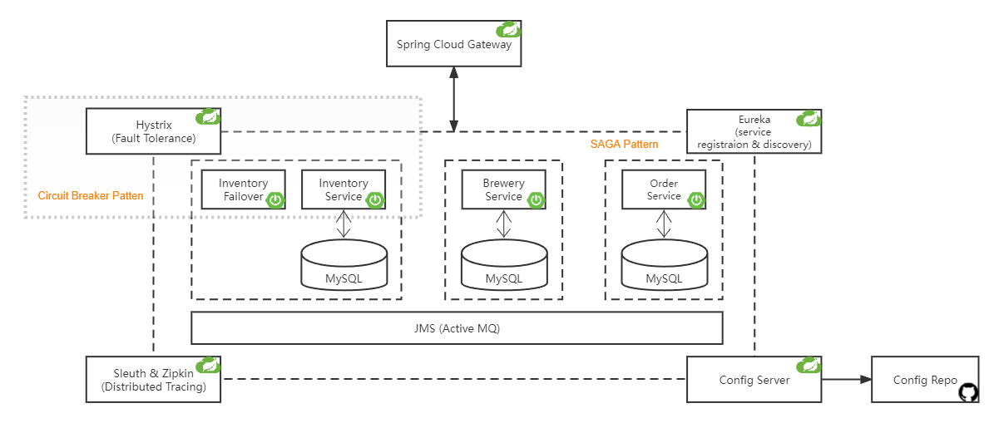

# Microservice-Backend-Beer-Store
This repo integrated various Spring Boot microservices &amp; Spring Cloud components repos, which constitue a backend service for a beer store.

Docker images of every microservices & components were built. 

- See [`How to deploy`](#how-to-deploy) to deploy the application **within 3 minutes** using docker. 

- See `Ports & APIs` for testing the functionality of the application.

- See [`Project Architecture`](#project-architecture) for a summarization of microservices & Spring Cloud components.

- See `Bussiness Logic` for how microservices interact with each other.

## How to deploy

- **Before you run it**: Make sure you have installed docker and docker-compose. Allocate enough RAM for your docker containers (8GB may be enough), as 12 containers will be running once started.

- In your terminal: 
  
  - `git clone the project`
  
  - `cd local-deployment`

  - `docker compose up`

  - Wait for 1 or 2 minutes for all the service to be up and functioning.
  
- Terminate the application: `docker compose down`

## 

## Project Architecture

